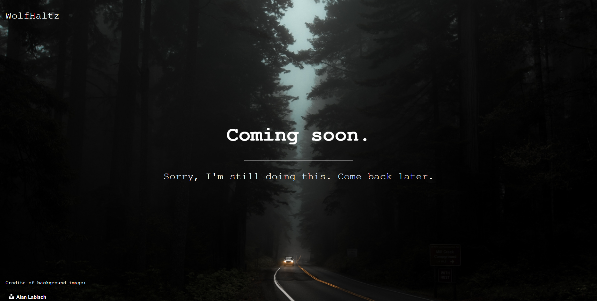

# Coming soon pages

<b>Made with:</b><br/>
HTML, CSS & JS
<br/><br/>
<b>What is this?</b><br/>
Pack of "Coming soon" pages.
<br/><br/>
<b>Description:</b><br/>
This is a repo with pages using only HTML, CSS and JS to do "Coming soon" pages. Feel free to use! :)
<br/><br/>

# Quick links &#128150;
  
[PROJECT SETUP](#Project-setup) &diams; [PREVIEW](#Preview) &diams; [STATUS OF THE PROJECT](#How-is-the-development-of-the-project-right-now) &diams; [CREDITS](#Credits) &diams; [BACK TO TOP](#Coming-soon-pages)


# Project setup
```
Open the selected HTML at your favorite browser ;)
```

<b>Thank you for your support!</b>

# Preview



# How is the development of the project right now?
<b>Last update:</b> 01/03/2021

I organizated the folder and update the readme. I guess that need more than one template to call this a pack HAHAHAHHA

<br/>

# Credits

Lorem ipsum dolor sit amet

<i>Stay awesome Gothan!</i>
  
[PROJECT SETUP](#Project-setup) &diams; [PREVIEW](#Preview) &diams; [STATUS OF THE PROJECT](#How-is-the-development-of-the-project-right-now) &diams; [CREDITS](#Credits) &diams; [BACK TO TOP](#Coming-soon-pages)
